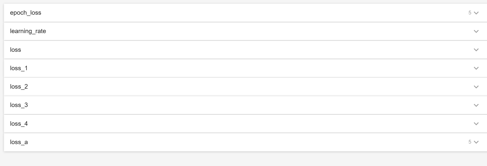
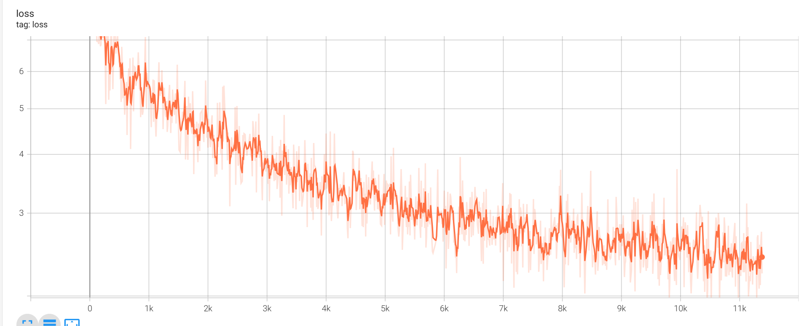
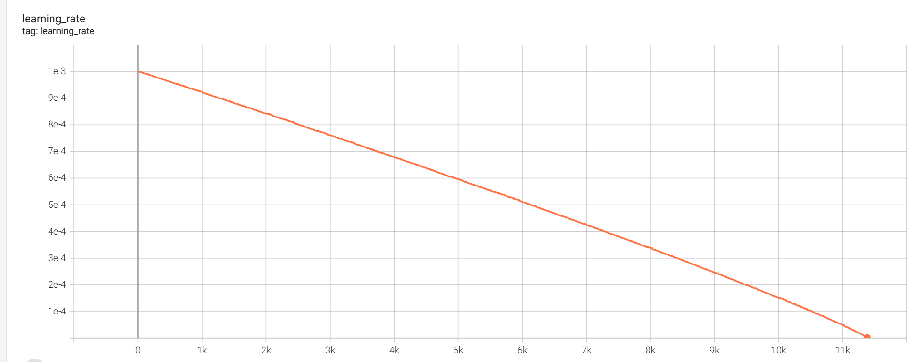
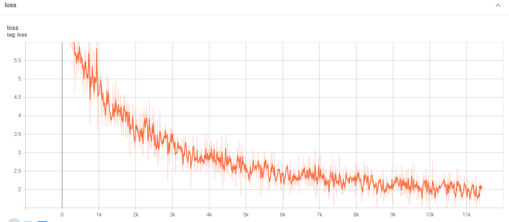
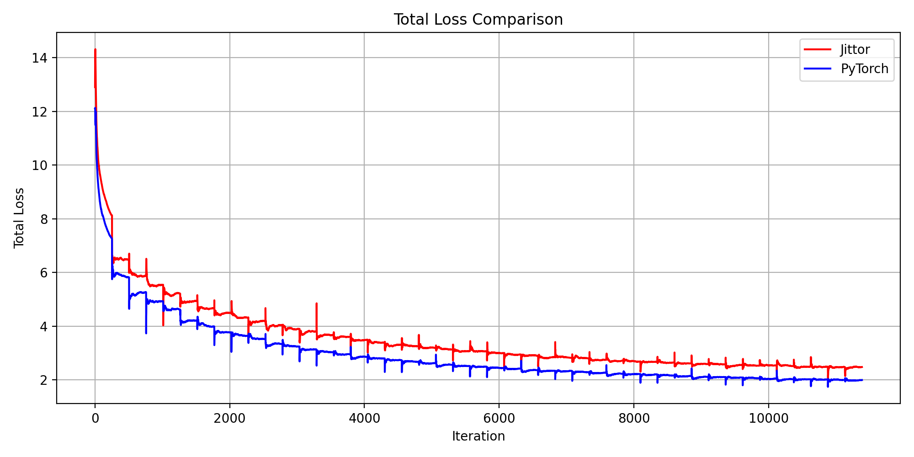
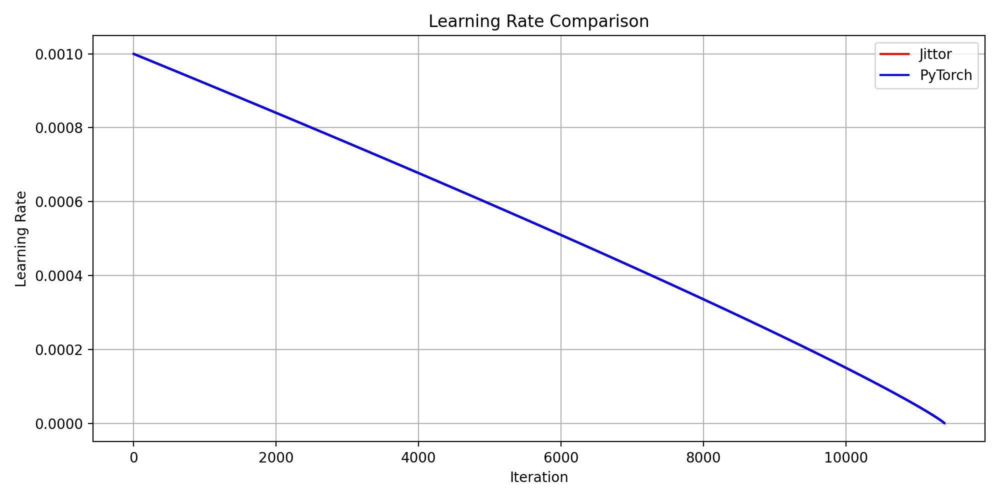

# CVPR2021_PFNet (Jittor Implementation)

## introduction

该仓库提供了 **PFNet** 的推理代码，使用了 [Jittor 深度学习框架](https://github.com/Jittor/jittor)。

> **Jittor** 是一个基于 JIT 编译和元操作的高性能深度学习框架。整个框架和元操作都是即时编译的。Jittor 集成了强大的操作编译器和调优器，使我们能够为您的模型生成高性能的专用代码。Jittor 还包含丰富的高性能模型库，包括：图像识别、检测、分割、生成、可微渲染、几何学习、强化学习等。前端语言为 Python。前端使用模块设计和动态图执行，这是深度学习框架接口中最流行的设计。后端则由高性能语言实现，如 CUDA、C++

## 环境配置

+ 操作系统: Jittor支持目前主流的操作系统,若要运行脚本请使用Ubuntu ,我使用的是WSL2-Ubuntu 22.04
+ 通过安装Anaconda并创建虚拟环境
+ 在指定的虚拟环境中安装环境以及Jittor文件（更多细节请参考这个 [官方安装教程](https://cg.cs.tsinghua.edu.cn/jittor/download/)）

#### 安装其他依赖库：
```shell
python3 -m pip install -r requirements.txt
```

#### 我的配置如下:
+ Jittor == 1.3.9.14
+ g++ == 9.5.0
+ python == 3.8
+ cuda == 11.8
+ cudnn == 8.9.7


## 数据准备脚本
### 数据集下载和组织
#### 训练集
根据论文内容. 训练数据集采用COD10K-train,并将其放入'./data/NEW/train'文件夹下
#### 测试集
根据[论文内容](),测试数据集采用COD10K-test + CAMO-test + CHAMELEON, 并将他们放入'./data/NEW/test/'文件夹下

下载的数据集在命名方式上与代码中的文件参数名称有出入,如果使用默认的**config.py**的数据集配置文件路径,请按如下文件夹名称组织
```shell
data
└── NEW
    ├── test
    │   ├── CAMO
    │   │   ├── image
    │   │   │   └── <camourflage_id>.jpg
    │   │   └── mask
    │   │       └── <camourflage_id>.png
    │   ├── CHAMELEON
    │   │   ├── image
    │   │   │   └── <animal-id>.jpg
    │   │   └── mask
    │   │       └── <animal-id>.png
    │   └── COD10K
    │       ├── image
    │       │   └── <COD10K-id>.jpg
    │       └── mask
    │           └── <COD10K-id>.png
    └── train
        ├── image
        │   └── <camourflage_id>.jpg
        └── mask
            └── <camourflage_id>.png
```
### 图像数据加载和变换增强
    在训练脚本会自动调用, 无需手动脚本运行
    


## 训练脚本
由于Jittor框架下加载'resnet50-19c8e357.pth'会报错,所以改用Jittor框架下的模型[resnet50.pkl](),可以运行compare_pth_ptl.py发现两者参数对比完全一致

启动脚本前,请正确配置**config.py**的ResNet50和测试数据集的文件路径
请配置**train.py** 的**args**变量中的各类超参数,默认如下:
```
args = {
    'epoch_num': 45,
    'train_batch_size': 16,
    'last_epoch': 0,
    'lr': 1e-3,
    'lr_decay': 0.9,
    'weight_decay': 5e-4,
    'momentum': 0.9,
    'snapshot': '',
    'scale': 416,
    'save_point': [],
    'poly_train': True,
    'optimizer': 'SGD',
}

```

训练的入口文件是**train.py**, 在该文件根目录下,通过以下脚本启动训练:
```shell
python  train.py
```


注意事项:
+ Jittor框架下的PFNet模型用本地设备4080Laptop来训练的，所以默认为单卡，如果使用多卡,请配置多卡运行依赖OpenMPI(参考[官方文档](https://cg.cs.tsinghua.edu.cn/jittor/tutorial/2020-5-2-16-44-distributed/))

+ 指定特定显卡的多卡训练脚本如下:
```shell
CUDA_VISIBLE_DEVICES="2,3" mpirun -np 2 python -m train.py
```

+ 如果配置不是很好,显存容易爆，模型推理会非常慢，因为此时大量数据存储在内存，而非显存,内存不足程序会崩溃,可以参照[官方文档]()优化
+ 实测在训练过程中会出现内存不足的现象,在**train.py**代码里面让Jittor在每一批数据的迭代中启用强制回收内存,代码如下:
```
# train.py line 194,195
jt.sync_all()
jt.gc()
```


## 测试脚本
加载预训练模型,请去原项目地址下载[PFNet.pth](https://github.com/Mhaiyang/CVPR2021_PFNet/blob/main/README.md)

提供我按照args原参数复现的Jittor框架下的模型**45.pkl**

提供同样训练的Pytorch框架下的**45.pth**(由于pytorch框架下设备能力有限,出现设备过热导致关机,所以我是用采用类似于断点训练的方式,每5轮保存训练模型,然后更改args参数的last_epoch,snapshot和save_point继续下5轮训练直到完成了45轮的训练)

测试的文件入口是**test.py**, 正确配置**config.py**中测试数据集所在目录,然后在该文件根目录下,通过以下脚本启动训练:
```shell
python test.py
```


## 实验log
***
### Jittor
每批次的loss值会自动记录在tensorboard文件中 

#### log文件说明
完全按照原项目的参数训练完45轮, 并且所有批次的log记录在[txt文档](ckpt_jittor/PFNet/2025-07-18-12-38-37-217476.txt)中
文件格式如下:
```
# 第一行保存模型训练的参数
{'epoch_num': 45, 'train_batch_size': 16, 'last_epoch': 0, 'lr': 0.001, 'lr_decay': 0.9, 'weight_decay': 0.0005, 'momentum': 0.9, 'snapshot': '', 'scale': 416, 'save_point': [], 'poly_train': True, 'optimizer': 'SGD'}

# 后面保存每批次的log,依次为: epoch, curr_iter, base_lr, loss_record.avg, loss_1_record.avg, loss_2_record.avg, loss_3_record.avg, loss_4_record.avg
[  1], [     1], [0.001000], [12.90296], [1.95275], [1.54159], [1.56621], [1.56905]
# ······
# ······
[ 45], [ 11385], [0.000000], [2.47790], [0.41270], [0.41672], [0.29909], [0.26257]
```
若也想要生成tensorboard能够可视化的数据,可以运行'./Src/utils/log_TensorBoard.py'文件,会将指定目录下的txt文件整合为tensorboard可视化文件，并放入原本loss曲线的tensorboard的log文件夹下

在根目录下使用以下脚本进行可视化:
```shell
tensorboard --logdir=ckpt_jittor/PFNet/log
```

#### 图片
tensorboard可读文件包含以下内容:



结果如下:



！[image](pic/jittor_loss_avg.png)


***

### Pytorch

提供Pyrorch框架下自训练模型**45.pth**的记录,在[./ckpt_pytorch/PFNet)](./ckpt_pytorch/PFNet)下
该模型采用断点训练,每5轮后保存,然后在该基础上继续加载直至完成45轮

#### 图片


！[image](pic/pytorch_loss_avg.png)


### matplotlib可视化
获得两个框架下的训练log的txt文件后,通过matplotlib获得pytorch和jittor训练模型保存在txt文件中的每种数据的对比图,如下:





Pytorch和Jittor两个框架下的loss和log的tensorboard文件可以通过该[百度网盘链接](https://pan.baidu.com/s/1mpSf_5dc66wFj8_76n9NAw)获取 提取码: rzrg


## 与Pytorch对齐的性能log

### 训练
> Jittor在加入内存优化代码后能够完整训练完45轮, 而Pytorch训练中由于设备显卡过热会导致设备关机采用的是类似于断点训练的方法

### 测试
运行test.py,记录图像处理速度如下:

|                | PyTorch    	 | Jittor  | Speedup    	  |
|----------------|--------------|---------|---------------|
| COD10K-test    | 88 FPS       | 344 FPS | 3.91x       	 |
| CAMO-test   	  | 58 FPS       | 314 FPS | 5.41x       	 |
| CHAMELEON-test | 88 FPS       | 364 FPS | 4.14x      	  |


## 结果

### 评价指标

用Jittor框架下自训练的**45.pkl**模型和Pytorch框架下自训练的**45.pth**模型以及原作者提供的'PFNet.pth'的评估指标数据如下:

| CHAMELEON dataset | $S_\alpha$  	 | $E_\phi$  	 | $F_\beta^w$  	 | M     	       |
|-------------------|---------------|-------------|------------|---------------|
| Jittor(45.pkl)    | 0.886       	 | 0.928       | 0.810      | 0.033	        |
| PyTorch(45.pth)   | 0.871      	  | 0.943       | 0.798      | 0.034    	    |
| Jittor(PFNet.th)  | 0.879      	  | 0.944       | 0.807      | 0.034    	    |
| Pytorch(PFNet.th) | 0.882         | 0.942       | 0.810      | 0.033         |
| 论文数据              | 0.882         | 0.942       | 0.810      | 0.033         |

| CAMO-Test dataset   	  | $S_\alpha$  	 | $E_\phi$  	 | $F_\beta^w$  	 | M     	 |
|------------------------|---------------|-------------|----------------|---------|
| Jittor(45.pkl)         | 0.782       	 | 0.860       | 0.690          | 0.084   |
| PyTorch (45.pth)       | 0.764       	 | 0.843       | 0.672          | 0.089   |
| Jittor(PFNet.th)       | 0.778      	  | 0.850       | 0.690          | 0.086   |
| Pytorch(PFNet.th)      | 0.782         | 0.852       | 0.695          | 0.085   |
| 论文数据                   | 0.782         | 0.852       | 0.695          | 0.085   |

| COD10K-Test dataset 	 | $S_\alpha$  	 | $E_\phi$  	 | $F_\beta^w$  	 | M     	    |
|-----------------------|---------------|-------------|----------------|------------|
| Jittor(45.pkl)        | 0.800       	 | 0.867       | 0.656          | 0.040      |
| PyTorch(45.pth)       | 0.795       	 | 0.875       | 0.657          | 0.040 	    |
| Jittor(PFNet.th)      | 0.798      	  | 0.875       | 0.660          | 0.040    	 |
| Pytorch(PFNet.th)     | 0.800         | 0.868       | 0.660          | 0.040      |
| 论文数据                  | 0.800         | 0.868       | 0.660          | 0.040      |

### 预测数据集
该[百度网盘](https://pan.baidu.com/s/1hxe8St9D-nNiRDSEw8suKQ?pwd=pz1k)提供Jittor(45.pkl) ,Jittor(PFNet.th),Pytorch(45.pth) 分别在3个测试数据集的预测结果,提取码: pz1k